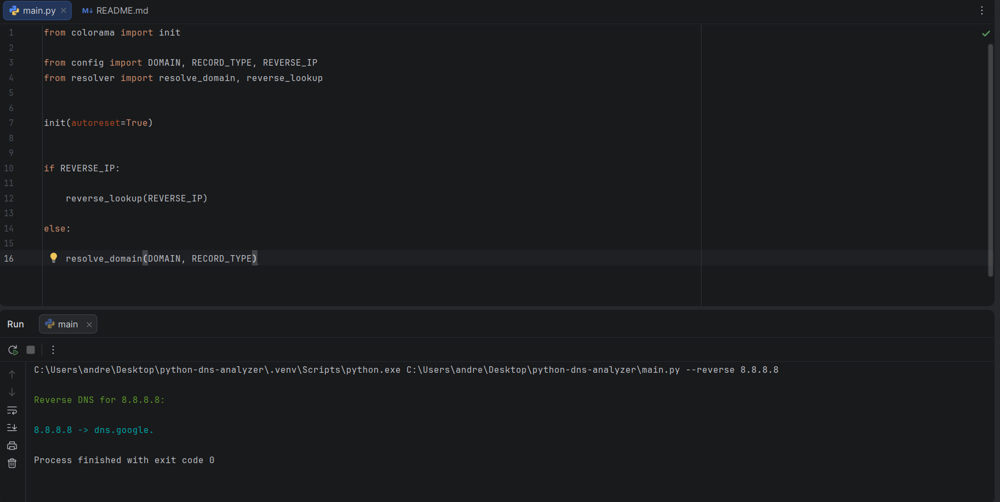

# Python DNS Analyzer

A Python-based DNS analysis tool for querying and investigating DNS records and performing reverse DNS lookups.

Supports:

* A record lookups
* MX record lookups
* NS record lookups
* CNAME lookups
* Reverse DNS lookups
* Logging
* CLI arguments

---

## Features

* Query multiple DNS record types
* Reverse DNS lookups (PTR records)
* Timestamped logging
* Professional command-line interface using argparse
* Error handling for invalid domains
* Modular architecture

---

## Technologies Used

* Python
* dnspython
* argparse
* colorama

---

## Installation

Clone the repository:

```bash
git clone https://github.com/andreicalin7/python-dns-analyzer.git
cd python-dns-analyzer
```

Install dependencies:

```bash
pip install -r requirements.txt
```

---

## Usage

### Query DNS Records

```bash
python main.py --domain google.com --type MX
```

### Reverse DNS Lookup

```bash
python main.py --reverse 8.8.8.8
```

### Help Menu

```bash
python main.py --help
```

---

## Example Output



---

## Features Demonstrated

* DNS protocol analysis
* DNS record enumeration
* Reverse DNS lookups
* CLI tooling
* Logging
* Modular Python architecture

---

## Why I Built This

I built this project to better understand how DNS works, how domains are resolved, how DNS records are structured, and how reverse DNS lookups are used in cybersecurity investigations and reconnaissance activities.

The goal was to create a practical networking and cybersecurity utility rather than a simple DNS lookup script.

---

## Future Improvements

* DNS response timing
* Subdomain enumeration
* DNS record export to CSV/JSON
* Bulk domain analysis
* Additional DNS record support

---

## Disclaimer

This project is intended for educational and authorized testing purposes only.
